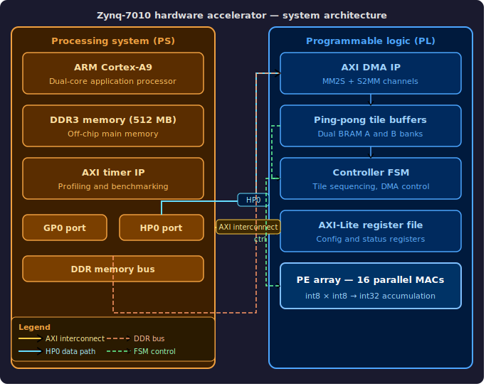
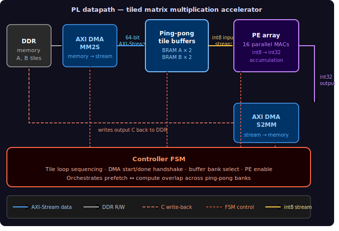
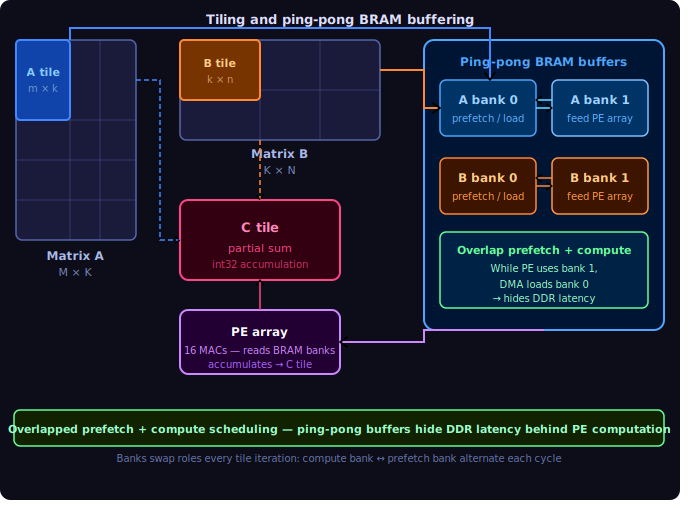

# 🚀 Hardware-Accelerated Matrix Multiplication on Zynq-7010

An optimized hardware-software co-design implementing high-performance matrix multiplication ($C = A \times B$) on the **Zybo Z7 (Zynq-7010)** FPGA platform. The system offloads the computationally intensive matrix multiplication to a custom, pipelined Processing Element (PE) array in the FPGA's Programmable Logic (PL), while the ARM Cortex-A9 Processing System (PS) manages data layout, cache consistency, and execution control.

---

## 🏛️ Technical Architecture Overview

The system splits computation between the ARM Processing System (PS) and the FPGA Programmable Logic (PL) using dual AXI interfaces:
* 🎛️ **Control Path**: Registers (CTRL, STATUS, DIM_M, DIM_K, DIM_N, NUM_KTILES) are accessed via an AXI4-Lite slave interface over the General Purpose GP0 port.
* 🌊 **Data Path**: Bulk matrix data is streamed between DDR memory and BRAM tile buffers via a Xilinx AXI DMA controller over the high-performance S_AXI_HP0 port.

### ⚙️ Core Hardware Features

* **64-bit AXI-Stream Integration** 🏎️: Allows high-bandwidth transmission of 8 packed `int8` input elements or 2 packed `int32` outputs per clock cycle.
* **Banked BRAM Design** 🗄️: Organized into 8 parallel BRAM banks for both B-tiles and C-accumulators to support parallel read and write accesses in a single clock cycle.
* **Ping-Pong Buffer Infrastructure** 🏓: Dual-buffer system (`A0`/`A1` and `B0`/`B1`) enables a complete overlap between compute and loading cycles.
* **True K-Tile Prefetch Overlap** 🔄: An independent prefetch loader FSM retrieves the next K-tile pair from DDR in the background while the MAC pipeline computes the current block.
* **Dual-Lane Output Packing** 📦: A dedicated output FSM reads two `int32` values sequentially and streams them out as a single 64-bit word, maximizing bus utilization.

---

## 📊 Final Performance & Speedup

Through progressive hardware and software refinements, the system achieved a **5.15× speedup** over the highly optimized ARM software baseline for 64×64 matrices.

| Optimization Stage | Software Time | Hardware Time | Speedup Factor | Key Improvement |
| :--- | :---: | :---: | :---: | :--- |
| **Phase 13**: Initial Tiled | 10,048 µs | 14,879 µs | 0.67× | Software-managed tiling; PS-side accumulation |
| **Phase 14**: PL Accumulation | 10,072 µs | 8,760 µs | 1.14× | Partial sums accumulated on the PL side |
| **Phase 15**: Pre-Packed Streams | 10,049 µs | 3,178 µs | 3.16× | Tile extraction/packing done outside the timed loop |
| **Phase 16**: 64-bit AXI-Stream | 10,072 µs | 3,293 µs | 3.05× | Transitioned stream width from 32-bit to 64-bit |
| **Phase 17C**: Fast Output Path | 10,073 µs | 3,171 µs | 3.17× | Dual-bank read FSM to accelerate stream-out latency |
| **Phase 18A**: 16-Column PE Path | 10,073 µs | 2,136 µs | 4.71× | Expanded parallel PE datapath to 16 concurrent columns |
| **Phase 18B**: True Overlap | 10,073 µs | 1,952 µs | **5.15×** | Computed current K-tile while prefetching the next |

---

## 📈 Progressive Phase Evolution

### 🛠️ Phases 1 to 8: Foundational Bring-Up
Phases 1 through 8 covered the crucial groundwork and infrastructure bring-up. This included writing the pure C software reference models, running Icarus Verilog simulations of individual Processing Elements, verifying AXI-Lite registers, and establishing basic AXI DMA loopbacks. With the infrastructure fully validated, the real hardware acceleration project begins at Phase 9.

### 🚀 Phase 9 — First Real DMA Matrix Multiply
* Integrated a 4×4 FSM multiplier with AXI DMA.
* **Outcome**: `MATRIX MULTIPLY 4x4 PASS` ✅

### 📐 Phase 10 — Scaling Dimensions
* Expanded internal registers and counters to handle larger matrices without tiling.
* **Outcome**: `MATRIX MULTIPLY 16x16 PASS` ✅

### 🧠 Phase 11 — 8 Parallel Processing Elements
* Added an 8-PE parallel compute array to calculate 8 columns simultaneously.
* **Outcome**: `8-PE MATRIX MULTIPLY PASS` ✅

### 💾 Phase 12 — BRAM-Based Tile Buffers
* Moved BRAM allocation away from LUTs to dedicated block RAMs.
* Designed banked B and C memories to eliminate port-contention bottlenecks.

### 🧱 Phase 13 — 64×64 Tiled Execution
* Designed a 32×32 tiled execution scheme with PS-side loop control.
* **Outcome**: `TILED MATRIX MULTIPLY 64x64 PASS` ✅

### ⚡ Phase 14 — PL-Side K-Tile Accumulation
* Moved partial accumulation logic into the hardware FSM.
* Added support for `NUM_KTILES` registers, dramatically reducing PS control overhead.

### 📦 Phase 15 — Pre-Packed Tile Streams
* Pre-formatted the memory layout of tiles in DDR before launching the execution loop.
* Maximized DMA burst efficiency by aligning and packaging streams early.

### 🛣️ Phase 16 — 64-Bit AXI-Stream
* Upgraded the stream data width to 64 bits.
* Streamed 8 `int8` elements per transmit beat and 2 `int32` accumulated elements per receive beat.

### 🏓 Phase 17A — Ping-Pong Buffer Infrastructure

* Duplicated A and B tile buffers in BRAM.
* Designed buffer selectors to swap active read/write buffers.

### 🏎️ Phase 17C — Faster Output Packing
* Refined the output FSM to read two `int32` elements sequentially from banked RAMs and stream them out packed in a single clock cycle.

### 🦾 Phase 18A — 16-Column Parallelism
* Doubled the parallel MAC paths to 16 concurrent columns.
* Expanded BRAM banking to 16 independent B and C banks.

### 🏆 Phase 18B — True K-Tile Prefetch Overlap
* Implemented an independent background stream loader FSM.
* **Outcome**: Reached a final **5.15× hardware speedup** with fully overlapped memory fetch and computation.

---

## 💻 Technology Stack

* **Hardware Platform**: Zybo Z7 Development Board (Xilinx Zynq-7010 SoC) 🎛️
* **EDA / Design Suite**: Xilinx Vivado & Xilinx Vitis (v2020.2 or later) 🖥️
* **Languages**: Verilog HDL, Bare-metal C 📜
* **Interconnect Standards**: AXI4-Lite (Control), AXI4-Stream (Data), AXI DMA (Direct Memory Access) 🔌
